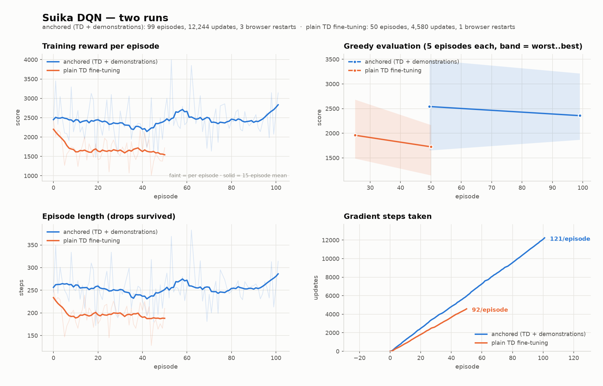

# What was measured

Every number here is a mean over whole episodes with its standard error, and
every comparison names its sample size. That discipline is the point: a
five-episode evaluation of this game has a standard error near 140 and cannot
detect a difference smaller than about 540 points, which is how two earlier
non-results in this project were briefly mistaken for signals.

## Where it ended up

| policy | mean | se | n | episode length |
|---|---|---|---|---|
| random | 1424 | 118 | 10 | 174 |
| DQN from scratch, original architecture | 1455 | 79 | 16 | 173 |
| cloned into the original (dense) head | 1530 | 68 | 25 | 186 |
| **cloned into the column head** | **2449** | 72 | 45 | 251 |
| cloned + anchored RL fine-tuning | 2420 | 45 | 98 | 254 |
| `greedy` hand-written policy | 2497 | 64 | 42 | 268 |
| **`layered` hand-written policy** | **2696** | 68 | 62 | 285 |

The learned agent went from indistinguishable-from-random to 2449, roughly 1.7x
the random floor. It is still below the hand-written policy it learned from,
and nothing tried here closed that gap.

## The findings, in the order they were established

### 1. A baseline was worth more than another training run

The agent scored 1455 against a random 1424 — a difference of 31 against a
standard error of 142. On its own that says nothing about whether the agent is
bad or the game is unwinnable, and without knowing which there is no way to
choose what to do next.

A hand-written policy settled it. It reads fruit positions out of the physics
engine, estimates where each of the 40 candidate drops would land — the
smallest `y` among the floor and every fruit whose horizontal span it overlaps,
contact at `y = fy - sqrt((fr+r)^2 - dx^2)` — and scores the resulting contact
set. No learning, no rollouts.

At 2497 against 1424, arithmetic on the game state is worth 1.75x random. So
the game is learnable and the agent was failing at it, which ruled out the
alternative reading.

The more useful half: points per drop barely moved (8.2 to 9.7) while episode
length went from 174 to 268. **Almost all of the gain is surviving longer**,
not scoring better per placement.

### 2. The architecture was the blocker, not the learning signal

Three attempts to fix the reward signal all produced a policy at the random
floor. They found real bugs on the way — an n-step return discounted by `gamma`
once instead of `gamma**k`, truncation treated as termination, a terminal state
carrying no penalty when score deltas are never negative — and fixing them
changed nothing measurable. Then the same network was given *perfect demonstrations* and cloned:

| head | cloned score | imitation regret | parameters |
|---|---|---|---|
| dense (flatten, then MLP) | 1530 | 0.603 | 739,593 |
| **column** | **2449** | **0.135** | **171,971** |

The original head took the board's width from 20 columns down to 5 through two
stride-2 convolutions and then flattened, so board position survived only as an
index into a 2560-vector that a dense layer treats symmetrically. Worse, each
of the 40 outputs carried its own parameters: whatever the network learned
about a column at one position did not transfer to the next, so the same
pattern had to be relearned forty times.

Not a hard limit on what those weights *could* express — a 740k-parameter
network can approximate a great deal. A limit on what this data could teach
them. The training losses say which: 0.64 for the dense head against 0.246 for
the column head, so it failed to fit examples it had already seen. Underfitting,
not overfitting, which is why regularising it changed nothing.

It scores random-level *given perfect examples*, and that is what makes this the
explanation for all three earlier non-results rather than one more hypothesis.

The column head never strides width. It reduces height away, leaves one feature
vector per board column, broadcasts the global context (fruit in hand, fruit
next, how full the board is) onto every column, and emits values that stay tied
to the board position they refer to. Better and 4.3x smaller.

The tell had been in the data and was misread once: a *small* train/holdout gap
next to a *bad* holdout score is underfitting, not overfitting. The first
response was regularisation, which closed the gap and left the score alone.

### 3. Fine-tuning forgets, and the fix has to be level-invariant

Cloning is capped by its teacher, so exceeding it needs reinforcement learning.
Plain TD fine-tuning from cloned weights destroyed the policy — twice, at two
learning rates, from 2449 down to about 1730 by episode 50.

Cloning standardises its targets per board, so the value stream comes out near
zero while Q-learning wants it near the discounted return. The dominant error
is a uniform offset, and a dueling head can only raise every Q through the
value stream, while the cheapest way to shrink the loss is to flatten the
advantage — the part that picks the column. Initialising the value head near
the Bellman fixed point slowed the collapse and did not stop it.

Keeping the demonstrations in the loss fixes it (Hester et al., 2018). The term
is applied to the **mean-centred** output, or the two losses fight over the
value level. `scripts/check_train_step.py` verifies the property: shifting the
value bias by 50 moves the TD loss by 37.27 and the demonstration loss by
0.00025.

Both panels on the left tell the same story: plain TD loses ~800 points and ~60
drops of survival within ten episodes, while the anchored run holds.

With the anchor the policy holds at 2420 ± 45 over 98 near-greedy episodes,
flat across every window (+61 ± 128 against cloning alone).

**That null is weaker than it looks, and the reason is a scaling mistake in
this repo.** The joint loss is `td + demo_weight * bc`, where the TD term is
divided by the action count — deliberately, so the pure-TD path keeps the
learning rate it was tuned with — and the demonstration term is not. The two
also live in different units: Q is in scaled-reward units of order 5-9, the
demonstration target is per-board standardised. Logging both terms during a
short run gives `td 0.030-0.041` against `bc 0.411-0.576`, so `demo_weight=1.0`
is really about **14:1 in favour of the demonstrations** and TD contributed
roughly 7% of the loss.

So the honest reading is not "reinforcement learning had its say and added
nothing". It is that reinforcement learning barely got a vote. What *is*
established: TD at full strength, with no anchor, destroys the policy (2449
down to ~1730, twice, at two learning rates). The region between — TD weighted
comparably to the demonstrations — is untested, because the knob did not mean
what its name said. Both terms are now printed every episode.

A separate hypothesis was tested and refuted. Every other failure in this
project traces to maximising over noisy estimates, so the plateau was expected
to be the same thing: an argmax over 40 Q-values selecting whichever action the
network overrates. `scripts/check_value_calibration.py` measures it over 2,704
states — bias `+0.095` on values of order 5, correlation with the realised
return `0.892`, and an argmax gap of `1.749`, so **bias / gap = 0.05**. The
margin the greedy policy selects on is eighteen times its systematic error. The
Q function is well calibrated and that explanation does not apply here.

### 4. Rewarding structure helped; looking ahead did not

Two heuristic terms were added: `stack`, rewarding a small fruit landing on a
bigger one, and `trap`, penalising a smaller fruit left inside the band a drop
covers. Together (`layered`) they are worth **+199 over `greedy`**, and a
permutation test on the first 42-episode pair gave p = 0.011.

A next-fruit lookahead — build each successor board, score the best reply with
the fruit that is known to be coming — scored 2498 against 2497, at 40x the
computation per move. Not a bug. The successor board is an estimate, so the
lookahead compounds two steps of model error and then maximises over 40 noisy
replies, which selects whichever successor the model got most optimistically
wrong.

### 5. Things that did not work, and are no longer in the tree

| removed | measured |
|---|---|
| dense Q-head | 1530 vs the column head's 2449 |
| pixel observations | the 353-episode run was void — the observation showed the *next* fruit, not the one being dropped |
| next-fruit lookahead | 2498 vs 2497 |
| afterstate value network | 1794, despite fitting well (holdout r = 0.837, MAE 115 against label sd 276) |
| CEM weight fitting | 2647, 2427, 2734 across three designs, against a 2696 baseline |
| surface roughness + pile height | +38 ± 116 |
| `neighbour` term | the condition could never fire; every run before its repair had it inert |
| prioritised replay, head resets | never exercised by any run that produced a result |

The afterstate network is the most interesting failure. It fits the true return
well, and the policy is still bad, because it was trained on the one afterstate
actually taken per step and then asked to rank forty — thirty-nine of them off
the distribution it saw. `argmax` does not tolerate that error, it seeks it,
selecting whichever board the network is most over-optimistic about.

That is the same shape as the lookahead failure and the first CEM run
(selecting the best of 12 candidates scored on 3 noisy episodes inflated the
result by +463). **Maximising over many noisy estimates selects for the largest
error, not the largest value** — it cost three separate approaches here.

Fixing the statistics did not rescue CEM either. A paired design that scored
every candidate on the same fruit sequences overfitted those particular games
(≈3150 on its five training seeds, 2427 held out); redrawing seeds each
iteration finally optimised the right thing and returned +38 ± 116. Three
optimiser designs all landing at or below the hand-guessed weights is the
evidence that the policy class, not the optimiser, is the constraint.

### 6. A finer action space does not help, and seeding pays less than expected

The drop position is discretised into 40 bins. Raising that to 200 was measured
against 40 on identical fruit sequences, with the order of the two arms
alternated across rounds:

| | mean | se | n |
|---|---|---|---|
| 200 actions | 2551 | 143 | 12 |
| 40 actions | 2660 | 162 | 12 |

Paired difference **-109 ± 261**, and 200 won 5 of the 12 games. No improvement,
at five times the candidate scoring per move. Forty bins already place a fruit
every 16.4 px, well inside the smallest fruit's 24 px radius, and the landing
estimate ignores roll and secondary settling — error larger than the 3.2 px that
200 bins buys. Resolution finer than the physics is noise.

A first attempt ran the two arms sequentially and reported 200 ahead by
+306. That was an ordering artifact: its 40-action arm came in 2.9σ below the
same policy's 62-episode value, and re-running with the order alternated
reversed the sign. Sequential arms confound the comparison with anything that
drifts over a session.

**Seeding helped less than claimed.** `reset(seed=)` fixes the fruit sequence,
and the expectation was that scoring two policies on the same sequences would
cancel the luck. It does not, for policies that differ much: they choose
different columns from the first drop, so the same fruits arrive into
completely different boards. Measured here, the paired difference had a
standard deviation of 905 against 748 for an unpaired one — pairing made it
*worse*. Common random numbers pay when the compared policies stay close to
each other, which two different action-space sizes do not.

Seeding is still worth having — it makes a single policy's episode
reproducible, which is what `scripts/check_seeding.py` verifies — but it is not
the variance cure it was introduced as.

## What would plausibly move it

The heuristic never simulates — it estimates where a fruit lands and never
checks. Every failure above traces back to that estimate: the lookahead
compounded its error, the value network was trained on estimated afterstates,
and CEM could only re-weight estimates.

Real physics rollouts on the top 3–5 candidates, rather than all 40, replaces
the estimate with ground truth at roughly 5 x 80 ms a move. That is a change of
policy class rather than another pass at tuning, and it is the next thing worth
building.

## Reproducing

    python scripts/heuristic.py --episodes 30 --policy layered   # the ceiling
    python scripts/heuristic.py --episodes 30 --random           # the floor
    python scripts/collect_demos.py --episodes 90                # ~24k boards
    python scripts/pretrain.py                                   # ~5 min
    python scripts/eval_policy.py --checkpoint runs/bc.h5 --episodes 25
